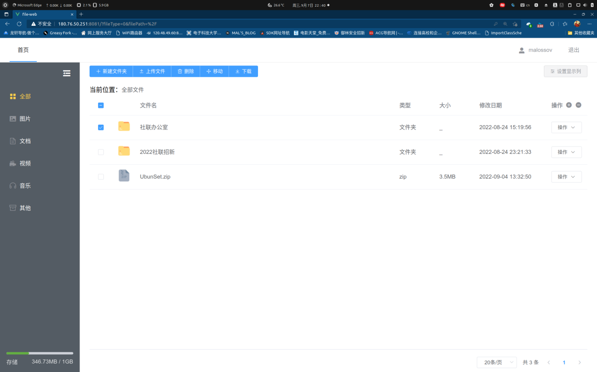

# **一年级新生课外创新实践项目**

## **四、项目成果**

| 序号 | 名称                               | 说明                                                                                    |
|------|------------------------------------|-----------------------------------------------------------------------------------------|
| 1    | 使用Servlet+HTML三件套完成初始网盘 | 并且完成所有漏洞的修复和漏洞分支拉取，可见：https://gitee.com/Rachel233/my-cloud-drive  |
| 2    | 使用SpringBoot和Vue.js重构网盘     | 可见：- https://github.com/MALossov/malpan-file和https://github.com/MALossov/malpan-web |
| 3    | 成功实现了文件的切片，秒传         | 同时使用MD5校验文件的完整性                                                             |
| 4    | 引入了JWT作为登录验证的Token       | 并且有失效期限                                                                          |
| 5    | 实现了邮箱验证码功能               | 并且可以匹配当前注册用户邮箱                                                            |
| 6    | 实现了网盘中图片文件缩略图的查看   |                                                                                         |
| 7    | 将网盘前后端分离部署，隐藏后端端口 | 提升安全性，同时禁用网盘服务的shell防止了远程代码攻击                                   |
| 8    | 书写了部分技术博客                 | 可见：malossov.gitee.io                                                                 |

# **五、项目研究结题报告**

# **攻防实践后的基于Vue和SpringBoot的网盘搭建和网络安全维护**

#### **摘要**

在本组成员进行攻防演练的实践过后，决定更换技术栈，使用Vue作为前端开发框架，SpringBoot作为后端开发框架。同时代码对于数据库结构、本地文件映射、前端接口交互方式进行全部重构。同时在代码开发设计的过程当中，后端开发上，注意了面向对象编程的规范和后端服务的不同层级架构，也对数据表中的数据关系进行了重新选择；前端开发上注重了对现有资源的利用，和对新技术的实践运用。同时额外关注了前后端分离时网盘的部署方式，在网络安全知识和认知上也有了更多了解。

**关键字：SpringBoot,Vue，网络安全，网盘**

目录

[一、 课题背景 5](#课题背景)

[二、 课题研究内容与方法 5](#课题研究内容与方法)

[三、 研究结果 5](#研究结果)

[1. 在网盘构建和漏洞验证阶段取得的成果 5](#在网盘构建和漏洞验证阶段取得的成果)

[2. 在网盘持续研究阶段取得的成果 6](#在网盘持续研究阶段取得的成果)

[四、 创新点 8](#创新点)

[1. 后端： 8](#后端)

[(1) 使用了SpringBOOT框架和新型的数据库配置、查询方法 8](#使用了springboot框架和新型的数据库配置查询方法)

[(2) 新型的数据库和文件、数据库和用户的对照关系 9](#新型的数据库和文件数据库和用户的对照关系)

[(3) 发送邮箱验证码的功能 9](#发送邮箱验证码的功能)

[(4) 文件MD5的校验和文件极速上传功能 10](#文件md5的校验和文件极速上传功能)

[(5) 整合JWT和MD5加盐验证方法作为用户身份认证的方式 10](#整合jwt和md5加盐验证方法作为用户身份认证的方式)

[2. 前端： 10](#前端)

[(1) 使用了Vue.js前端框架，并使用ElementUI辅助视觉效果搭建 10](#使用了vuejs前端框架并使用elementui辅助视觉效果搭建)

[(2) 使用了Vuex和Vue Router,增强网盘状态和路由的灵活性。 11](#使用了vuex和vue-router增强网盘状态和路由的灵活性)

[(3) 直接使用前端完成切片，MD5生成等文件上传下载服务。 11](#直接使用前端完成切片md5生成等文件上传下载服务)

[3. 网络攻防实践学习 11](#网络攻防实践学习)

[(1) 使用无shell权限的用户来进行网盘服务进程的管理 11](#使用无shell权限的用户来进行网盘服务进程的管理)

[(2) 前后端使用不同端口 11](#前后端使用不同端口)

[(3) 使用Git分支管理不同漏洞版本 12](#使用git分支管理不同漏洞版本)

[五、 结束语 13](#结束语)

[六、 参考文献 14](#参考文献)

# 课题背景

云存储自从提出以来就受到学术界以及商业领域的关注，并且投入了大量社会资源用于研究，云产品也不断迭代更新，不断提升产品性能和用户体验。国内云存储服务发展迅速，网盘产品层出不穷。但是大多数网盘都更注重数据的可靠性，保证数据不会因为故障造成数据丢失，并未对数据采取足够的安全保证。

随着用户对数据安全性及个人隐私保护的重视，网盘安全问题对网盘的应用推广有着极大影响。

在学习基础开发中，认识网盘云存储工作原理；在学习常见安全漏洞及其攻防中，对网络攻防有初步体验。

在进一步的自由探索中，开发方向可以通过丰富完善网盘功能来提高开发能力以及创新能力、通过引入框架感受框架的便利性与原理并积累开发经验；安全方向可以学习更多种安全漏洞与攻防方式来了解更多的网络攻防手段，同时也能提高平时细节处的网络安全意识。

# 课题研究内容与方法

本项目以自主编写的网盘为一个载体，真正的研究内容是对网站搭建中有可能产生的安全性漏洞进行系统性认知和实操体验漏洞的危害和修复，同时在攻防的过程中，对网络安全产生一个初步且较为系统的认知。

# 研究结果

## 在网盘构建和漏洞验证阶段取得的成果

本项目在第一阶段的任务为：搭建网盘“靶机”并完成搭建网盘过程当中基本漏洞的修复。经过近一个学期的制作与完善之后，本组完成了该阶段的内容，包括：网盘本身的搭建和对于响应漏洞的防御，漏洞复现，以及修复的总结报告和修复方法。

本组成员在完成本项目时，一开始便把在保证后端质量的同时，我们还精心制作了较为美观的前端界面。并且成功通过中期检测的验收。

同时，在项目进入后半期中，我们也使用Git对于项目漏洞进行分支创建和漏洞复现。

图 1中期答辩时的旧网盘

## 在网盘持续研究阶段取得的成果

图 2新网盘注册界面的展示

在网盘探索阶段，本组成员不满足于使用于简单的HTML+JS+CSS对于前端页面进行编写。选择主要进行前端的完善和功能的增加作为项目的着力点：

在改进过程当中，我们首先选择使用Vue.JS+ElementUI作为开发的主要方向，通过elementui提供的资源库，进行快捷的前端页面布局、编写，逻辑调用。随后发现，Vue中拥有多样且完善的第三方库，比如vue-easy-uploader等能够较为方便地实现切片上传等功能；同时Vue官方支持的库：Vue Router,Vuex和Axios，能够较为轻松地实现：动态路由请求、状态控制、含参请求控制，而不再依赖于简单的ajax语法和简单的返回状态判断。

图 3新网盘存储界面的展示

因此，为了配合前端的升级，我们选择在简单了解原理的情况下，对我们的后端进行重构，使用SpringBoot作为后端服务框架，在该框架下，我们通过重新书写代码，使用JPA进行数据库的创建，重新构建文件-数据库-显示方式之间的关系，将在创新性部分详细论述。

现在，通过映射实体文件到数据库中的关系，我们将文件-文件数据-用户文件-用户分别做了一对多或者或者多对一的映射关系，可以通过数据库构建带有文件夹的前端显示，同时加入了mybatis-plus进行高级映射。

在进行本地文件存储的过程当中，我们参考了其他项目实现了切片上传和文件MD5码的校验保证上传后的成功率。同时在上传前，我们也使用前端先对MD5码进行校验，做到极速上传。也加入了邮箱验证。

在前端上，我们也因为后端的改变能够更方便地使用json格式的数据包进行前后端交互，也引入了文件分类的对应显示格式的前端界面，进行了顶部横条，面包屑导航，侧边导航栏的设置。同时引入了文件结构树结构显示，文件分类显示，文件显示图标的相关代码，做到了界面简洁，美观，同时代码逻辑清晰。

# 创新点

## 后端：

### 使用了SpringBOOT框架和新型的数据库配置、查询方法

在本项目的最终成品当中，我们使用了SpringBoot作为项目后端框架，较好地整合了mybatis-plus，spring-web-mvc等框架，同时按照设计规范进行了service层、model层、service层和controller层的书写和布置。

同时引入了lombok和hibernate进行JPA的实现，保证了代码的可读性好，又使用工厂类让文件传输拥有统一的接口，实现了项目分支结构清晰、规范、统一，实现了高内聚、低耦合的接口、实体配合关系。

也通过maven实现了.jar格式的打包方法，能够做到在远程环境下一键启动，不依赖于tomcat环境，有效隐藏了后端资源的访问，增强了后端的安全性。

如图为本项目的大致结构，使用SpringBOOT让各层之间的交互工作：如VO,DTO等交互工作变得更加清晰和易于维护；同时，将向前端暴露的API分别分装为不同的Controller，让后端解耦变得更加容易。同时实现文件工厂类，方便对本地文件操作进行更加方便的管理。

下图为三个比较重要的层：

图 4网盘项目中的关键包

### 新型的数据库和文件、数据库和用户的对照关系

在最终的网盘版本当中，我们重构了数据库——在原本网盘的数据库当中，我们只使用单表保存用户信息，并且在保存数据信息之后使用明码进行信息的传输，非常容易遭到破解。同时对于文件请求采用直接查询本地文件的方法，效率、准确性、安全性较低。

因此，在进行数据库重构时。如上图我们采用三张表进行数据的存储——分别是存储本地文件信息的File表，存储用户信息的User表，将前两张表统一、构成能够查询用户文件的UserFile表。其可用E-R图进行表示为：

图 5网盘的数据库结构图

其中文件数据表代表的就是物理存储，它跟磁盘存储的文件是一一对应的，用户文件属于逻辑存储，用户在前台对文件进行移动复制等操作，其实只是做一些数据库的操作，但是指向文件的 url 没有变动。

在整个 E-R 图的演进过程中，本来属于文件的属性，本网盘中却把它放到了用户文件这一层，比如文件名，扩展名，是否是目录，其原因是修改文件名和扩展名，是不会影响文件本身的内容的。另外在文件磁盘存储的角度是不存在目录这个概念的，它只是我们在管理层面抽象出来的，因此它也需要被放在到用户文件这个数据库表中。

### 发送邮箱验证码的功能

在前一个网盘的尝试过程当中，我们发现有的组在尝试攻击我们的网盘时，随意使用虚假邮箱作为身份认证进行注册和攻击，因此，我们在本次网盘的构建当中，使用了SMTP协议进行验证邮箱的发送，同时将验证码和请求注册的邮箱放入Session当中，并在5分钟之后自动删除Session，防止验证码的重复使用和滥用。

图 6验证码示例

### 文件MD5的校验和文件极速上传功能

Spring Boot 默认会限制文件上传文件大小 2M，超过该大小的文件都会上传失败，因此我们必须将文件做切片上传。因此我们在前端通过切片后，上传服务器，并在全部文件传输完毕之后拼接，校验前后端MD5值来判断文件是否上传成功。如果文件已经上传过，则直接比较MD5特征码，进行极速上传。

图 7文件数据表使用了md5

### 整合JWT和MD5加盐验证方法作为用户身份认证的方式

认证有一个缺陷，就是用户的关键信息，比如用户名等信息是通过明文来进行传输的，因此基于安全考虑，我们使用了json web token作为用户身份的认证方式。我们使用了HS256作为签名算法，同时使用Base64方法作为加密的秘钥。

在后端，在通过对JWT进行解密后可以获得用户的原始密码。

同时，为了防止拖库后密码被破解，我们在后端采用了将原始密码加盐后进行MD5处理，将密文存入数据库当中，实现了密码数据在传输和存储之中的安全。

## 前端：

### 使用了Vue.js前端框架，并使用ElementUI辅助视觉效果搭建

使用了Vue，利用组件能够较好地连接起页面的每个部分，提高代码复用率、且让代码更好维护。同时将数据双向绑定，能够轻松渲染页面控件的状态。结合ElementUI提供的控件库，可以使用较少的代码完成较复杂功能的实现：如在本项目中使用的：NavMenu 导航菜单、Table 表格、Breadcrumb 面包屑等。

### 使用了Vuex和Vue Router,增强网盘状态和路由的灵活性。

Vue Router 是 Vue.js 官方的路由管理器，和 Vue.js 的核心深度集成，可以帮我们快速创建、配置路由，同时可以轻松完成路由和组件的对应，在单页上形成较为复杂的效果：如，在登入主页能直接切换到注册页面同时能够不重新渲染、刷新页面。

### 直接使用前端完成切片，MD5生成等文件上传下载服务。

使用了开源插件 vue-simple-uploader 来封装文件上传组件，此插件具有文件秒传、切片上传、断点续传的功能，同时使用计算文件 MD5 的方式，来让后台判断是否有相同文件已存在于服务器中。同时也能够上传文件缩略图，做到图片文件的预览。

图 8网盘实现缩略图和图片分类功能

## 网络攻防实践学习

### 使用无shell权限的用户来进行网盘服务进程的管理

在linux服务器上，建立专门用户组和用户进行网盘服务的启动、管理，该用户的权限无法访问到系统终端，因此无法利用后端进行远程命令执行，彻底杜绝WebShell的发生。同时，该用户文件访问权限低，无法通过网盘后端的文件漏洞访问到关键的系统文件。

### 前后端使用不同端口

在服务器上屏蔽了后端端口，无法直接通过url访问到后端。使用nginx进行url的转发实现，同时使用VueRouter守护项目路由，无法访问特定url以外的路由位置，同样防御了远程文件访问的发生。

图 9对于前端8081端口开放,后端8888禁止

### 使用Git分支管理不同漏洞版本

方便在结题时进行漏洞的复现，同时能够巩固已经学习到的网络安全知识，同时在复现漏洞的过程当中对于自己也是一定挑战。

图 10项目漏洞分支情况

# 结束语

本项目在进行第二部分的规划时，在原定完成前端页面重构的基础之上，对于后端也同样进行了SpringBoot框架的尝试和利用。通过本次实践，本组也在认知了基本网络安全知识之后，对于数据库、面向对象编程的编程思想有了更深的理解，在应用新特性，新机制的同时，对于语言本身的特性和各类“语法糖”和语言机制也有了更深的理解。也在用轮子的过程当中，通过调试进入轮子的类，逐渐理解了造轮子的用意，稍稍理解了部分轮子的构建方法。

在前端上，从HTML三件套到VueJS是一种编程思维上的飞跃。同时，Vue拥有的路由、异步处理发送，状态，双向绑定也让本组对前端框架，函数的生命周期，浏览器的运作方式有了更深层次的理解。

同时，在将项目部署到服务器时，我们也对nginx如何做路由，网络的内外网，服务器的端口设置等有了更新层次的理解。

# 参考文献

1.  Vue.js - 渐进式 JavaScript 框架[EB/OL].(2022.9.6)[2022.9.6].https://cn.vuejs.org/
2.  什么是springboot？[EB/OL].(2022.9.6)[2022.9.6].https://zhuanlan.zhihu.com/p/133534252
3.  奇文网盘[EB/OL].(2022.9.6)[2022.9.6].https://pan.qiwenshare.com/docs/
4.  Element - The world's most popular Vue UI framework[EB/OL].(2022.9.6)[2022.9.6].https://element.eleme.cn/2.13/\#/zh-CN
